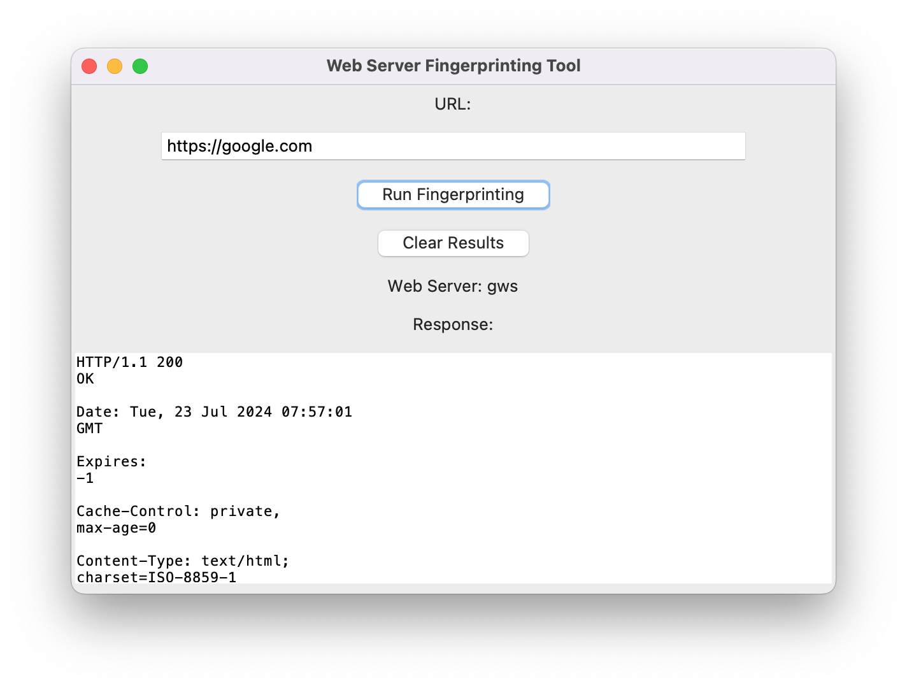

# Web Server Fingerprinting Tool

## Description

The Web Server Fingerprinting Tool is a Python application with a graphical user interface designed for identifying web servers by analyzing HTTP responses. This tool can be used to determine the type of web server software running on a specified URL.

## Features

- **URL Input**: Enter the URL of the website you want to fingerprint.
- **HTTP Banner Grabbing**: Connects to the specified web server over HTTPS, sends an HTTP GET request, and retrieves the response. Handles redirections by following `301` and `302` HTTP status codes.
- **Server Identification**: Analyzes the HTTP response to extract and identify the web server software, including common platforms like WordPress and Joomla. If the server software cannot be determined, it will return "Unknown".
- **Response Display**: Shows the raw HTTP response in a text area for further inspection.
- **Clear Results**: Provides an option to clear the URL input field and reset the displayed results.

## Usage

1. **Enter URL**: Input the URL of the target web server in the provided text entry field.
2. **Run Fingerprinting**: Click the "Run Fingerprinting" button to initiate the analysis.
3. **View Results**: The HTTP response will be displayed in the text area, and the identified web server will be shown below the response area.
4. **Clear Results**: Use the "Clear Results" button to reset the input field and clear the displayed results.

## Dependencies

- `tkinter`: For creating the GUI.
- `socket`: For network connections.
- `ssl`: For secure connections over HTTPS.
- `re`: For regular expression operations.
- `urllib.parse`: For URL parsing.

## Example

When the tool is run and a URL is entered, it will connect to the server, grab the HTTP banner, and attempt to identify the web server software based on the response headers and content. The result will be displayed in the GUI.

## Limitations

- The tool assumes HTTPS connections by default (port 443). Adjustments may be needed for HTTP connections.
- The identification is based on common server markers and may not cover all server types.
